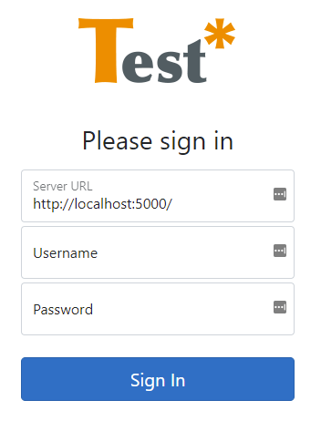

# Getting started
This article explains how to get started with the new Analysis UI for TESTAR. During this article, we assume you have a docker environment up and running and that you are familiar with the basic docker commands. 

## Setting up the server container
The TESTAR .NET server can be downloaded with the following command: `docker pull rneeft/testar-net-server`. 

Before running the container, please make sure you know the OrientDB location and the name of the TESTAR database.

To run the container execute the following docker run command:
``` ps
docker run -i -dp 5000:80 --name="Testar-Server" `
  -e JwTokenGenerator__JwtSecurityKey="hfjdhfdifngyuernguinfdfs4235tfmguh" `
  -e JwTokenGenerator__JwtIssuer="http://localhost" `
  -e JwTokenGenerator__JwtAudience="http://localhost" ` 
  -e JwTokenGenerator__JwtExpiryInSeconds=3600 `
  -e OrientDb__OrientDbServerUrl="http://192.168.188.28:2480" `
  -e OrientDb__StateDatabaseName="testar" `
  rneeft/testar-net-server
```

If you have multiple databases running in OrientDb, it is possible to enable the 'multiple database support' feature by adding `-e OrientDb__MultiDatabaseSupport="true"` to the `docker run` function.

Please supply a long string with random characters to the `JwTokenGenerator__JwtSecurityKey` key.

## Setting up the UI container
The UI container is running at https://app.testarin.net. Setting up the UI container is, therefore, optional.

The docker image for the UI can be downloaded with `docker pull rneeft/testar-net-ui`

The run the container execute the following docker run command:
```ps
docker run -i -dp 80:80 --name="Testar-UI" rneeft/testar-net-ui
```

## Signing in
Navigate in your browser to the location of the Analysis website. https://app.testarin.net or the URL of your docker. Click on the `Login` button.



The server URL is the URL to the **.NET server**, NOT the OrientDB URL. The username and password are the credentials from OrientDB. 

## Questions, feature requests or issues
For any feedback, please use the GitHub issues page at https://github.com/TESTARtool/ChangeDetection.NET/issues.
