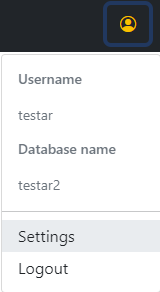

# TESTAR Analysis Version 

## Version 1.5.0
Version 1.5.0 includes changes in the graph element viewer. 

## Version 1.4.0
Two changes in this version. The first is a setting screen in which some changes to the graph viewer is made possible. The search screen can be opened from the user menu.

### Setting screen

It is now possible to specify which label to show in the graph viewer and to enable a compound layer in the viewer.

### Comparison
This version introduced a expiremental feature, compare. Before it is possible to use this feature, its need to be enabled in the settings screen. When enabled a new option appears on the selected model view. 

This is open a side by side graph viewer window where two graphs can be compared. More features to come.

## Version 1.3.0
It is now possible to filter the available models in the overview. Filtering is enabled for the name, version and the model identifier. 

## Known issues
See all open issues by following the below link.

[Known issues](https://github.com/TESTARtool/ChangeDetection.NET/labels/known-issue)

