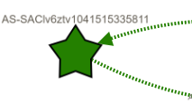
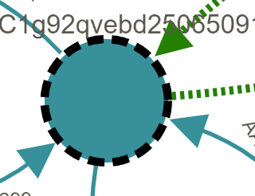
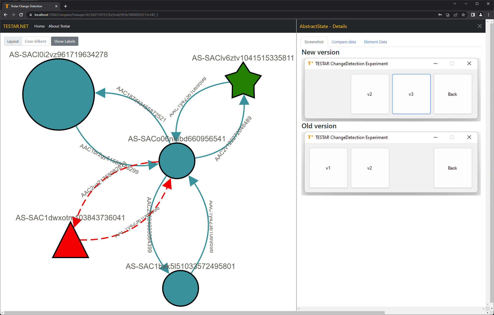

# TESTAR Analysis Release notes
The page covers the release notes of the new TESTAR .NET Analysis website. 

## Version 1.9.0
*Note the compare features needs to be enabled on the settings page*

The change detection algorithm visualisation got an update indicating a change in new actions and updated corresponding states better. 

New actions are displayed in a green dotted arrow. 

When a change in a corresponding state is found, the state is shown with a dashed circle. 

Since the algorithm's core works by looking at actions to find new and removed states, a corresponding state is indicated as a change when the algorithm finds a change in actions. In a later version, this can be changed into an in-depth change detection within the state, such as comparing widget trees.

## Version 1.8.0
*Note the compare features needs to be enabled on the settings page*

The comparison feature got an upgrade in this version. It will compare two versions and merge the two graphs into a merge graph. The red triangle represents a removed state, whereas the green star shows a new state.

Selecting a state in the graph shows screenshots from the new and old versions. A new or removed state only displayed a single screenshot. 

The version of the server container is also updated to version 1.8.0 but does not contain changes.

## Version 1.7.0
When there are multiple edges between two vertices, the edges overlap. This version addresses that issue by merging the edges into one single edge. When the edge is selected, they appear in an accordion where the data can be viewed individually.

The merge feature is turned on by default but can be disabled on the settings page.

## Version 1.6.0
Version 1.6.0 contains a couple of changes. 

### Login when using a deep link
When using a deep link, for example, loading a graph, the application is used to load the main page after sign-in. In the new version, the deep link is kept as a ReturnUrl and navigated automatically after login

### Compare result
*Note the compare features needs to be enabled on the settings page*

When comparing two models, the details page shows the element data in three sections: Added, Removed and Changed. The Element data also features some additional data like corresponding elements.

### Inspect widget tree
One of the last features of the old analysis website was the widget tree. This feature is now included and can be found when viewing the data from a concrete state.

## Version 1.5.0
Version 1.5.0 includes changes in the graph element viewer. The graphics have been upgraded to adopt the style of the rest of the website. 

Each Id in the list is now clickable and enables a full deep link in the URL. This makes it easy to share the URL with a colleague. 

## Version 1.4.0

### Setting screen

It is now possible to specify which label to show in the graph viewer and to enable a compound layer in the viewer.

### Comparison
This version introduced an experimental feature, compare. Before it is possible to use this feature, it needs to be enabled in the settings screen. When enabled, a new option appears on the selected model view. 

This opens a side-by-side graph viewer window where two graphs can be compared. More features are to come in later versions.

## Version 1.3.0
It is now possible to filter the available models in the overview. Filtering is enabled for the name, version and model identifier. 

## Version 1.2.0
This version has no visual upgrade but a health endpoint for the docker image. To check whether the docker container is healthy, execute a GET request to `/healthz`. The result should be `Healthy`.

## Version 1.1.0
The models' overview page has got a new visual upgrade. The Logout button has been replaced with a user menu. 

During login, it is possible to access different databases. Add the name of the database in front of the username. This required to server to be set up with the multiple database feature enabled. 

## Version 1.0.0
The first version of the new TESTAR .NET analysis website. It contains some early access to change strategies and the first graph viewer.

## Known issues
See all the open problems by following the below link.

[Known issues](https://github.com/TESTARtool/ChangeDetection.NET/labels/known-issue)